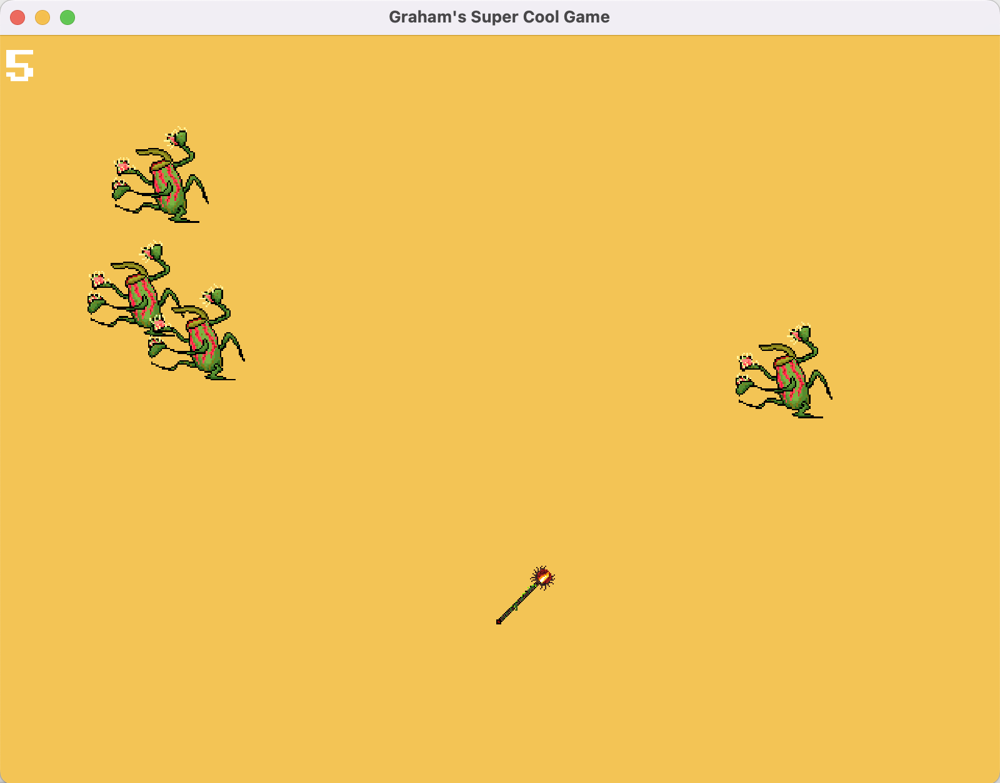

# Game for CompSCI
*A GrahamSH project*

A clicker game made in C++ using SFML.
## How to run
To start, clone this repository by running `git clone https://github.com/GrahamSH-LLK/game.git` in your terminal. Then, go into the directory by running `cd game`. 

SFML is fairly hard to install. I recommend using the my precompiled binary of this game at `bin/GAME`. You should be able to open it by running `./bin/GAME`. If you can't, you can run `chmod +x ./bin/GAME` to make it executable.
This binary is compiled for M1 Macs using the exact instructions detailed below.

If you want to install it yourself and compile, you can follow these instructions. 

1. Install homebrew (if you don't have it already) (https://brew.sh/). It might take a little bit to install. Make sure to run the command it gives you at the end of the installation.
2. Install SFML by running `brew install sfml pkg-config`
3. Clone this repository by running `git clone https://github.com/GrahamSH-LLK/game.git`
4. Go into the directory by running `cd game`
5. Compile the game by running `g++ $(pkg-config --cflags --libs sfml-graphics) main.cpp -o bin/GAME -std=c++11 && ./bin/GAME`

## Reflection
i. Was your project successful? If not, explain.
Yes, it was.
ii. What hurdles did you experience during your project? How did you
overcome them?
Installation of SFML took a bit of time, but I was able to get it working.
iii. Did you learn anything new during this project?
I learned how to make a C++ gui using SFML.
iv. Would you change your project? If so, what would you change?
More levels, more characters, make it more interesting. Sidescroller?